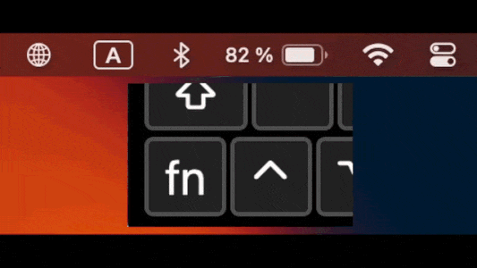

# LangSwitch

LangSwitch is a lightweight macOS menu bar app that cycles through your keyboard languages (input sources) with a quick tap of Fn/🌐 or Command (⌘), without the system language-switching popup.

## Features

- **Choose your switching keys.** Enable Fn/Globe, Command, or both from the **Modifier Shortcuts** menu. Command switching supports either the left or right Command key.
- **Launch at login.** On macOS 13 or later, enable **Launch at Login** to start LangSwitch when you sign in.
- **Hide the menu bar icon.** Choose **Hide Menu Bar Icon** to keep LangSwitch running in the background. Open LangSwitch again while it is running to restore the icon.

## Quick start

1. Download and install LangSwitch from the [latest release](https://github.com/makhnevvitalik/LangSwitch/releases/latest), then open the app.
2. Click the globe icon in the menu bar and open **Modifier Shortcuts**. Both switching options are off by default; enable the one or ones you want to use.
3. Complete the setup for your chosen key below, then briefly tap and release it to switch to the next input source.

### Fn/Globe

In **System Settings → Keyboard**, set the Fn/Globe key action to **Do Nothing**, then enable **Modifier Shortcuts → Fn/Globe** in LangSwitch. If macOS is using the key for a system action, or LangSwitch cannot read its setting, LangSwitch keeps this option off and offers to open Keyboard settings.

### Command

Command switching requires **Accessibility** access so LangSwitch can distinguish a standalone tap from shortcuts such as Cmd+C. Enable LangSwitch in **System Settings → Privacy & Security → Accessibility**, then enable **Modifier Shortcuts → Command** in LangSwitch again. If the app is missing from the Accessibility list, use **+** to add it manually.

# P.S.
MacOS Sonoma has improved language switching. They removed the popup, and switching is faster. But still it can be glitchy and works with bugs from time to time. So this app can still be relevant)

**How to use:**
- Download and install the app from the releases page.
- Disable the default macOS 🌐 button click action in Keyboard settings.
- Run the LangSwitch app.

# License

New versions of LangSwitch are licensed under the MIT License + Commons Clause
License Condition v1.0. This means the MIT License is subject to the Commons
Clause: you may use, study, modify, and redistribute the source code, but you
may not sell LangSwitch itself or a product/service whose value derives entirely
or substantially from LangSwitch.

Earlier versions that were already published under the MIT License remain
available under those MIT terms. Original and third-party notices are preserved
in [THIRD_PARTY_NOTICES.md](THIRD_PARTY_NOTICES.md).

LangSwitch is source-available, but it is not OSI open source under the current
license.
